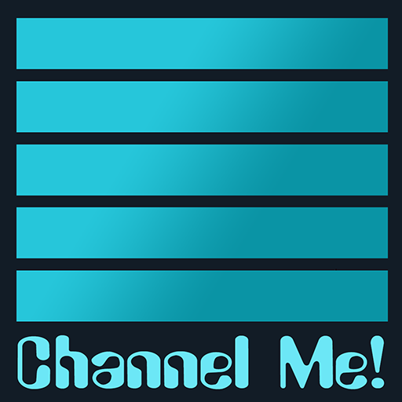
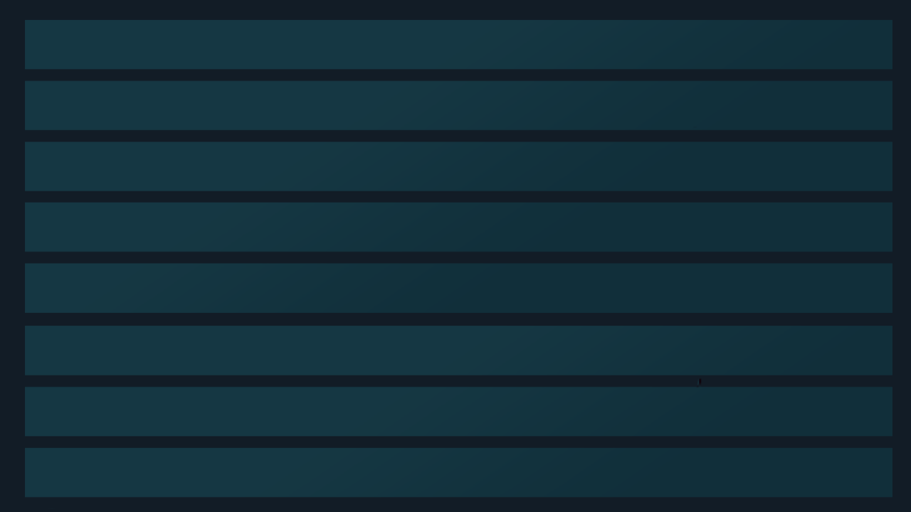

<!-- ======================= Display logo / banner ======================= -->

  

<h1 align="center">ChannelMe!</h1>

  <em>Custom TV-style channels built from your Kodi video library.</em> 
  Kodi 21 (Omega) &bull; video add-on &bull; GPL-3.0-or-later

---

# What it is

ChannelMe! turns your existing Kodi library into endless, personal TV channels.
Pick any mix of shows, movie collections, movies and folders; choose how they
shuffle; press play and it runs continuously like a broadcast channel - each show
advancing in episode order while the choice of *which* title plays next is random.

No scraping, no external services: it reads your library through Kodi's own
JSON-RPC, so it inherits your titles, episode order, artwork and watched state.

  
<!-- ============================== Features ============================= -->
# Features

### Channels
- **Build a channel from anything in your library** - TV shows, movie sets
  (collections), and individual movies, in any combination.
- **Folder sources** - add a folder of loose video files (e.g. under `/Videos/`)
  that are not in the Kodi library; ChannelMe! enumerates it recursively and treats
  the videos as one total series.
- **Channel artwork** - each channel borrows artwork from one of its titles, either
  a random title (re-rolled on each refresh) or one you pin.
 

### Playback
- **Two shuffle modes:**
  - *Serialized random* - each show plays in true episode order; the channel picks
    which show airs next at random.
  - *Pure random* - any episode / film / file at any time.
- **Endless** - a background service tops the queue up forever, so a channel never
  runs dry until you stop it.
- **Resume per title** - stop mid-episode and that show resumes exactly where it
  was the next time the channel plays it.
- **Skip-aware** - jump ahead or back in the generated queue and the upcoming line-up
  regenerates sensibly instead of pushing your _last-viewed_ dozens of episodes ahead.
- **Back-to-back cap** - limit how many episodes of the same show can air in a row
  (1-20 or unlimited).
- **Starting episode** - set where in a show/collection the channel begins for easy setup, or correction.
 

### Library context menu (right-click any library item)
- **Play Randomized** - instantly play a **TV show, movie collection, season, or
  folder** in pure-random channel style, without saving a channel. On demand.
- **Add to Channel** - append a **show, collection, or folder** to an existing
  channel (or spin up a new one).
 

### The editor
- **Inline title checklist** - tick titles directly in the list; no popped dialogs.
- **Type filters** - TV / Sets / Movies / **Files**, plus a substring search.
- **Files filter** - shows the folder paths already on a channel so you can keep or
  drop them; deselect + Save removes a path from the channel.
 

### Browsing
- **Sort channels** by name or **Last played** (the channel you watched most
  recently floats to the top).
- The **+ Add new channel** row stays pinned at the bottom under any sort.
 

### Localization
- All on-screen text is externalized to `strings.po` (English included). Translators
  can add a language by dropping in a new `resource.language.*` folder.

  
<!-- ============================ Installation =========================== -->
# Installation

1. Download the latest `plugin.video.channelme` ZIP (or `git archive` this repo).
2. In Kodi: **Settings -> Add-ons -> Install from zip file** and select it.
   - On Android, "Install from zip" can fail with an "invalid structure" error;
     copy the folder into Kodi's `addons/` directory via adb/file manager instead.
3. Launch from **Video add-ons -> ChannelMe!**.

> A populated Kodi **video library** is required - ChannelMe! builds channels from
> what Kodi already knows about.

  
<!-- ============================== Usage =============================== -->
# Usage

**Create a channel:** open ChannelMe! and choose *+ Add new channel*. Name it, tick
some titles, pick a mode, and Save. Select the channel to start playing.

**Play something instantly:** right-click any show, collection, season, or folder in
your library and choose **Play Randomized**.

**Grow a channel from the library:** right-click a show / collection / folder and
choose **Add to Channel**.

**Manage folder paths:** open a channel in the editor and use the **Files** filter
to keep or drop the folders on it.

  

<!-- ======================= Contributing / i18n ======================= -->
# Translations

Copy `resources/language/resource.language.en_gb/strings.po` to a new
`resource.language.<code>` folder and translate the `msgstr` lines. Pull requests
with new languages are welcome.

  
<!-- ============================= License ============================= -->
# License

GPL-3.0-or-later - see [LICENSE.txt](LICENSE.txt). &copy; 2026 GaianHelmers.

ChannelMe! is free software: you can redistribute it and/or modify it under the
terms of the GNU General Public License as published by the Free Software
Foundation, either version 3 of the License, or (at your option) any later version.

  

